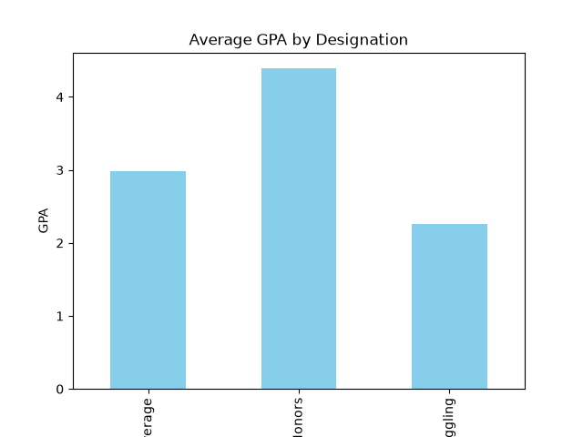

# Student Performance Data Analysis

A Python project analyzing student GPA and study-time data using Pandas, NumPy, and Matplotlib.

## What this project does
- Loads and cleans student data from a CSV file
- Calculates average GPA grouped by performance category (Honors, Average, Struggling)
- Computes statistical measures like mean and standard deviation using NumPy
- Identifies top 5 performing students
- Visualizes average GPA by category using a bar chart

## Tech Stack
- Python
- Pandas
- NumPy
- Matplotlib

## How to run
1. Clone this repository
2. Install dependencies: `pip install pandas numpy matplotlib`
3. Run the script: `python analysis.py`

## Sample Output

## Key Insight
Students in the "Honors" category showed significantly higher average GPA compared to "Average" and "Struggling" categories.DD
